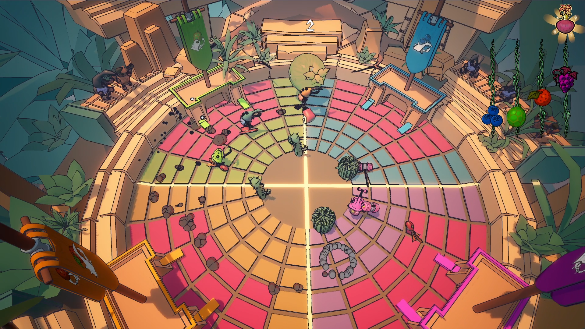
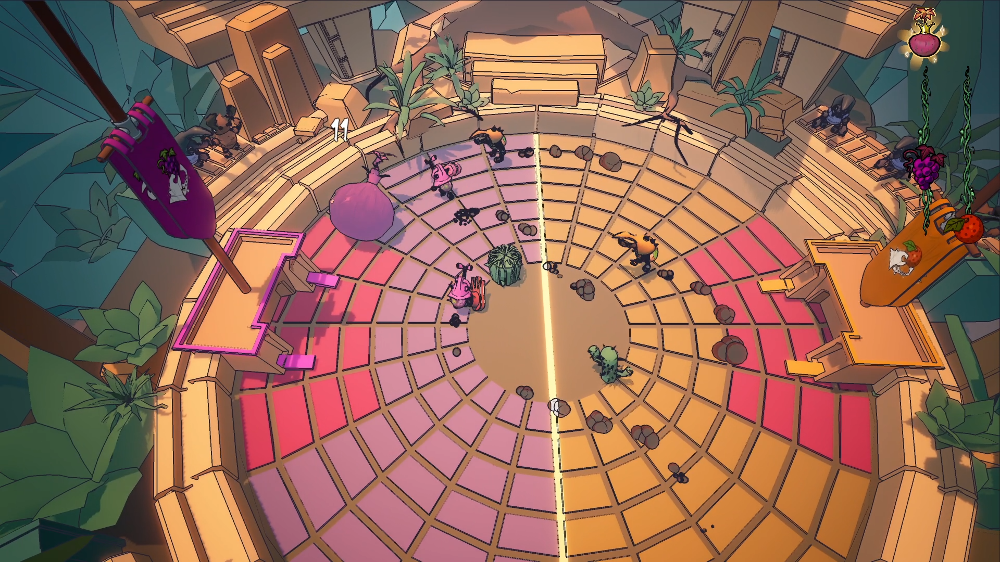
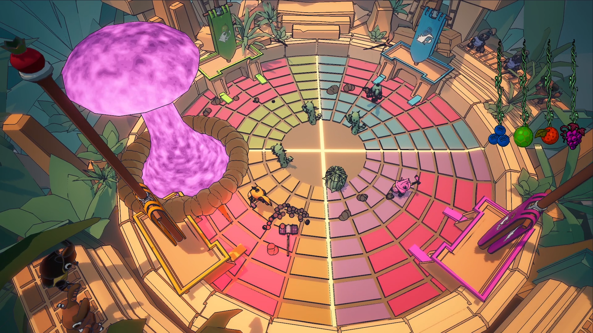
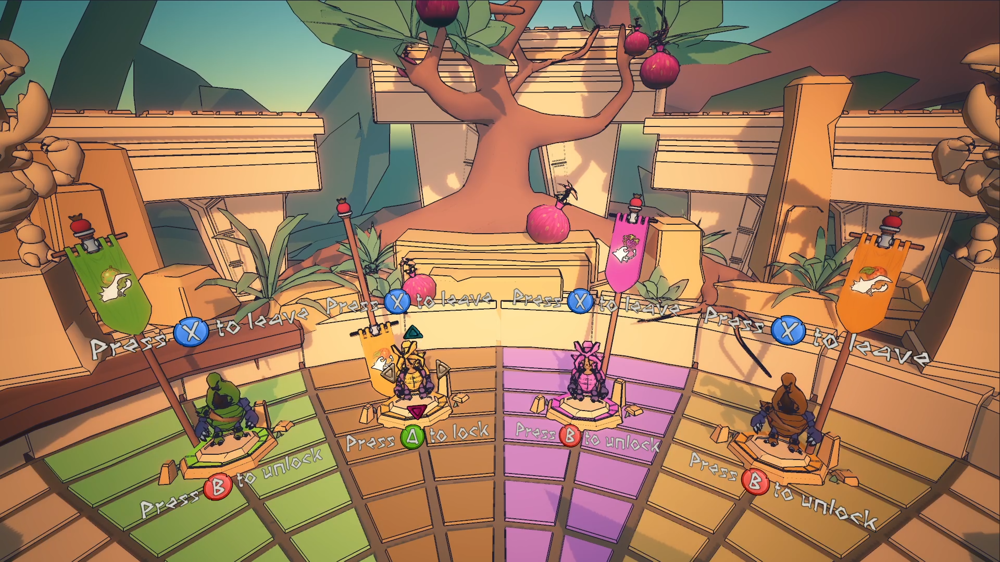
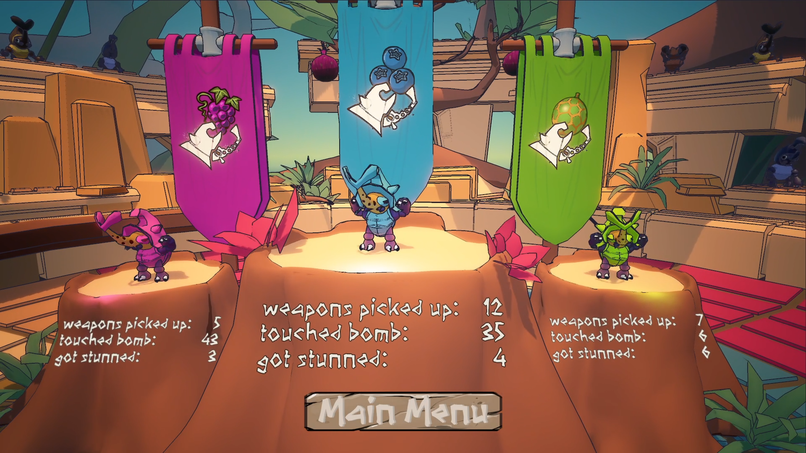

# Beetlefield Blast

Explosive fruit.  Armored bugs. One ticking time bomb

In this frantic arena brawler, you play as fantastical, weapon-wielding beetles locked in a high-stakes battle over a ticking explosive fruit bomb. Your goal? Smack that bomb toward the enemy’s side before it blows—and pray it doesn’t blow up on yours.

## Itch page
[View Here](https://nuffuru.itch.io/beetlefield-blast)

 

## Description
We made this project over the course of a semester with 3 programmers and 3 artists.

## Gameplay Loop
- A bomb-fruit drops in the center of the arena.

- Beetles battle to bash, kick, and weapon-whack the bomb onto the enemy’s side.

- After 20 seconds, the bomb explodes, dealing a point of “damage” to the team it’s closest to.

- If it explodes on your side, you lose a point. If it’s on theirs, you gain a point.

## Features
- Many different ways to team up
- Two different character types

## Tools and languages used
Unity, C#
