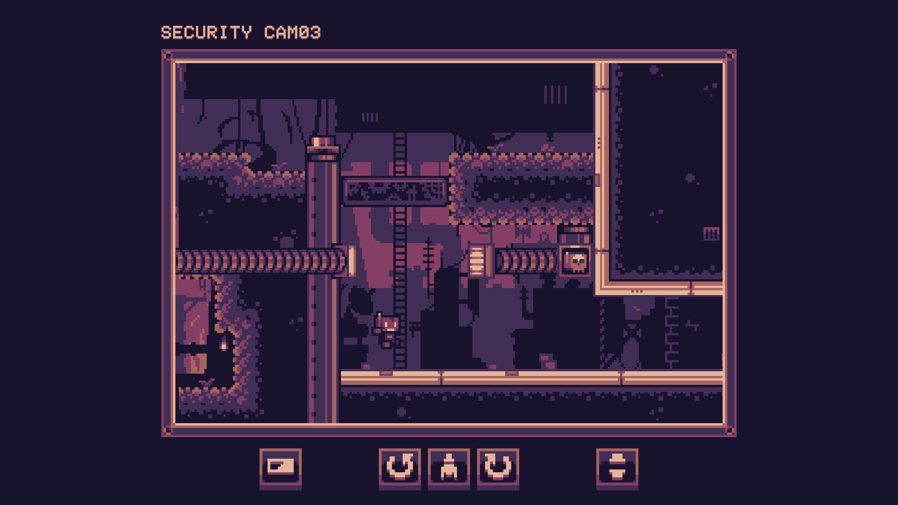

# Road To Game Dev

Before starting my game develoment studies I experimented by joining a few game jams and seeing what I could make.
These projects served as my introduction to game development and are the main reason I'm currently pursuing a career in the industry.

I've sorted the projects in chronological order to map my timeline before starting at DAE.

---

## 2021: Cat & Mouse Dairy Quest (Unity, C#)
At 15 years old, I spent a week of my summer participating in the brackeys game jam. It was my first released project on itch.
In this game we follow a cat & mouse duo overcoming an evil lactose intolerant king. The cooperation of the cat and mouse was a key part of the gameplay, since the theme was 'Stronger Together'.

It is a silly wacky platformer with pretty basic gameplay, but I had a great time making it and sparked love in me for game development.
I later ported it for android and launched it on the google play store out of interest. It is no longer up, but I learned a lot from this again as well.

<iframe width="560" height="315" src="https://www.youtube.com/embed/htHgebch1rs" title="Build String presentation" frameborder="0" allow="accelerometer; autoplay; clipboard-write; encrypted-media; gyroscope; picture-in-picture" allowfullscreen></iframe>

---

## 2023: Stopbot
After a hiatus of starting (but never finishing...) a bunch of projects on and off, I decided to join the GMTK Game Jam in the summer of 2023.
This time I teamed up with an artist through the GMTK discord server, so this game actually has all original art. The theme this year was 'Roles Reversed'

We only had **2 DAYS** to make a game this time. And together with my very talented colleague we made a game about stopping a robot from escaping from a testing facility. The roles here were reversed, because instead of being the usual hero completing the level, you are now stopping the AI player from doing so. 

You can control objects in the level with on screen controls and you can track the robot with security cameras. You could use a crusher, a turret and platforms to succeed in your task. There are only a few levels and limited gameplay, but for 2 days I really liked our results. It was an amazing (and stressful) experience.

---

## 2024: Gigabot
*I guess I like robots huh...*

After 1 year of DAE, I joined the 2024 GMTK Game Jam. This time we received 4 days time to make a game fitting the theme of 'Built To Scale'.

I decided it would be fun to experiment with Godot. A game engine I had only recently discovered and knew very little about besides it being open-source and apparently somewhat similar to unity.

I made a basic arena brawler where you have to defeat 4 waves of robots. Each wave you and your enemies would size up. You can pick up objects laying around the map to throw at your enemies. The size of debris you can pick up depends on the size you currently are. Whilst dodging and attacking the robots, you have to also avoid ominous death beams.

This time around I made the models for the game myself with my newly acquired low-poly blender skills from my 3D1 course. This also meant I spent less time on the game itself this time. This combined with being new to the engine itself caused it to not be my best work in my opinion. But it was still a fun experience, and I learned a lot.

