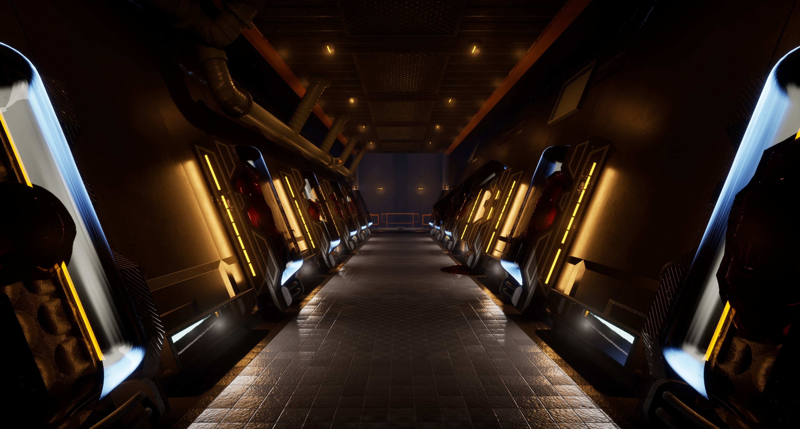
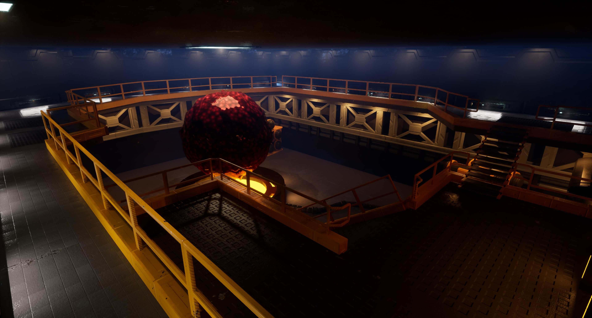
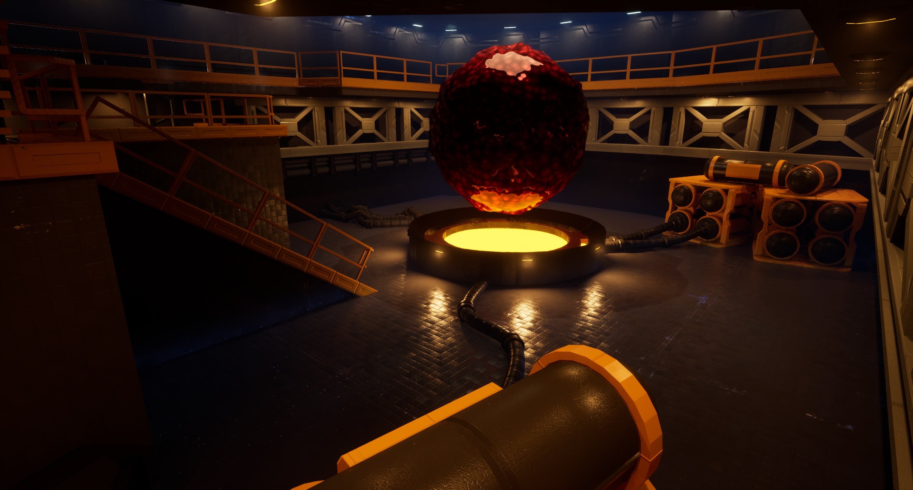

# Sci-fi Environment

For an elective course in the first semester of my second year we made environments using Unreal Engine 5.
We focused on a modular workflow to create a convincing high quality environment within a theme. I made this sci-fi environment for my exam.

---

---

<iframe width="560" height="315" src="https://www.youtube.com/watch?v=dOEAwbLDNMU" title="Environment Presentation Video" frameborder="0" allow="accelerometer; autoplay; clipboard-write; encrypted-media; gyroscope; picture-in-picture" allowfullscreen></iframe>

<iframe width="560" height="315" src="https://www.youtube.com/watch?v=oGmvfDAwLiA" title="Environment Gameplay Video" frameborder="0" allow="accelerometer; autoplay; clipboard-write; encrypted-media; gyroscope; picture-in-picture" allowfullscreen></iframe>

---

## My Takeaways

I'm very happy I was able to make this and that I chose to follow this course.
It has given me a better insight and understanding in what artists do, and therefore makes it easier to communicate and collaborate.

---

## Tools Used

**Unreal Engine 5**, **Blender**
